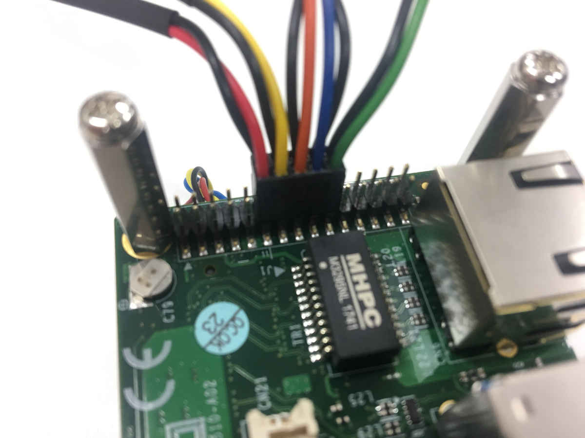

# Flash OS and BSP to Jetson TX2 on N510 carrier board

This is a short guide for how to flash OS and BSP to Jetson TX2 on the Ateina ACE-N510 carrier board.

### Why this guide

The available guides and software for how to do this were incomplete, incorrect, or out-of-date,
so we had some struggles with getting it to work properly.
We were able to flash the standard Jetson TX2 package, but that lacks support for some of the
ports on the Aetina ACE-N510 carrier board. In particular, the USB 3.0 connections were unavailable.

With some help from Aetina support, we were able to flash the board correctly with the following procedure.

## Connections

### Host computer

 - Native Ubuntu 14.04 installation (16.04 may work as well, but 18.04 was unsupported by our version of JetPack)
 - Internet connection
 - Micro USB cable to connect to the Jetson board

### Jetson board

 - Button connections on the J1 Expansion I/O Header (see [Aetina ACE-N510 User Manual](https://www.aetina.com/products-detail.php?i=234) or the picture at the bottom of this document.)
 - Power
 - (Recommended) Monitor and keyboard to inspect the result of installation

## Installation

### Get software

Clone this repository. It includes files received directly from Aetina support.
```
git clone https://github.com/tbwhill/jetson-tx2-n510_setup.git
cd jetson-tx2-n510_setup
```
Download JetPack 3.1 from the [Jetson Download Center](https://developer.nvidia.com/embedded/downloads).

Move it into our setup directory.
```
mv ~/JetPack-L4T-3.1-linux-x64.run .
```

### Install JetPack
```
./JetPack-L4T-3.1-linux-x64.run
```
At the `JetPack L4T Component Manager`, do `Clear Actions` using the button at the top left, select `Target - Jetson TX2`, and choose Action `install`. Dependencies will also be included. Move forwards with this installation. It it large and will take a few minutes.

When you get to the screen saying
```
Host Installation is complete.
Installer will continue with target hardware setup.
```
Instead of clicking `Next>` to proceed, choose `Cancel` to exit JetPack.

### Modify installation with Aetina's BSP

Before we flash, we need to include the correct BSP. Extract Aetina's modification, and run setup.sh
```
sudo tar -zxvf R28_1_TX2_N510_1_Fortest_180413.tar.gz -C . --numeric-owner
./setup.sh tx2 N510
```

### Flash Jetson TX2
```
cd 64_TX2/Linux_for_Tegra_tx2/
sudo ./flash.sh jetson-tx2 mmcblk0p12
```
Hopefully, the flash process will complete successfully after a few minutes, and the Jetson will automatically reboot.

## Verify

Check for USB 3.0 availability by plugging in a USB 3.0 compatible device and running
```
lsusb -t
```

## Button Connections


